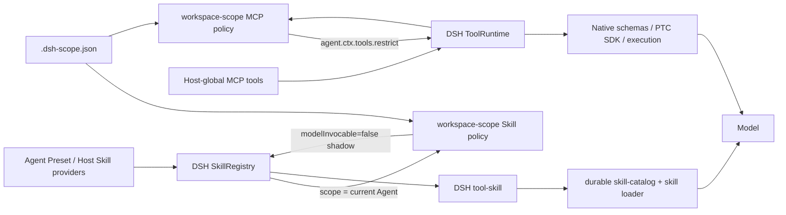

# dsh-workspace-scope

[](https://github.com/Ri0n72Y/dsh-workspace-scope/actions/workflows/ci.yml) [](https://www.npmjs.com/package/dsh-workspace-scope) [](https://github.com/deepseek-ai/deepseek-harness/releases/tag/dsh-v0.1.5-rc.1) [](https://github.com/Ri0n72Y/dsh-workspace-scope/blob/main/LICENSE) [](https://github.com/Ri0n72Y/dsh-workspace-scope/releases)

## The plugin is under active development and releases frequently

A DeepSeek Harness workspace capability-policy plugin: apply project-level enable/disable policy to Skills already visible to the current Agent and to Host-global MCP servers.

DSH Agent Presets, Host plugins, and Skill providers supply capabilities. This plugin does not install Skills or create a second Skill catalog. It applies `.dsh-scope.json` over the current Agent's effective capability view so different workspaces can expose different subsets.

MCP scope here explicitly means Host-global MCP tools inherited by an Agent. MCP / Tool registrations inside an Agent or Preset scope are outside this plugin's management boundary. DSH 0.1.5 `ToolSchema` does not expose stable MCP owner metadata, so MCP `serverName` values managed by 0.5 must not contain `__`; raw tool names may contain `__`.

See [docs/architecture.md](docs/architecture.md) for the complete Skill / Tool data flow, C4 diagrams, and the 0.5 integration invariants.

中文版：[README.md](README.md)

## Usage

The entry is shown for a blank new-session Session: the "Workspace scope" button in the input card's right-side tool row. Ongoing conversations do not show it. The policy locks when that conversation starts its first real model request, so edits on the new-session screen still apply to the conversation about to start; later file edits do not mutate that already-locked Agent.

The dialog groups the currently manageable capabilities into Skills and global MCP servers:

- Skills come only from the model-invocable scoped Skill view of the current blank Session's Agent; switching Agent Preset refreshes the list
- Skills absent from the current Agent, or natively configured with `modelInvocable: false`, are not shown; saved names for other Presets remain in `.dsh-scope.json`
- Each row has an enable switch; a Skill disabled by the current workspace keeps the ordinary disabled state
- Clicking a row expands details (Skill description or global MCP tool count)
- Search, enable-all, and disable-all operate on capabilities manageable in the current UI; changes save immediately

Saving writes `.dsh-scope.json` in the workspace root.

When the current Agent exposes a model `skill` Tool surface, Skill policy refreshes at the start of each `agent/pre-step`: the plugin first reads the current Agent's DSH `SkillRegistry` view, then registers exact-Agent shadows for workspace-excluded Skills with `modelInvocable: false`. DSH `tool-skill` then builds its Skill catalog and `skill` loader from that same scoped view. Excluded Skills that remain user-invocable can still be loaded explicitly with `/skill-name`.

Host-global MCP policy is applied during real `system-prompt/assemble` through the Agent's native `tools.restrict()`. When the effective mask changes, the plugin asks DSH to rebuild the full assembly once so native Tool schemas, the PTC SDK, lookup, and execution use the same ToolRuntime view.

## Configuration

The file is `.dsh-scope.json` in the workspace root:

```json
{
  "default": {
    "mode": "whitelist",
    "skills": ["<skill-name>"],
    "mcps": ["<server-name>"]
  }
}
```

| Field | Type | Meaning |
|---|---|---|
| `mode` | `string` | `default` enables everything; `whitelist` treats the lists as allowed sets; `blacklist` treats them as excluded sets. The UI preserves existing whitelist/blacklist semantics; the first disable from `default` converts it to `blacklist` |
| `skills` | `string[]` | Meaning follows `mode`; names hidden by the current Agent remain stored for other Presets |
| `mcps` | `string[]` | Meaning follows `mode`; only Host-global MCP servers are managed |

## Data flow

Skills and Tools/MCP keep using DSH's native registries; workspace-scope inserts only a policy layer.



In DSH 0.1.5 the Skill catalog is a durable `user/message` produced by `tool-skill` during `agent/pre-step`; it is not a `system-prompt` text fragment. This plugin does not parse or rewrite `<available_skills>`. DSH does not currently expose the private ToolDefinition identity used by `tool-skill`, so custom Presets that shadow the official loader with another same-name `skill` Tool are outside 0.5's exact support boundary; see the architecture document.

## Contributing

Open an issue for bugs or ideas. Before sending a pull request, read [CONTRIBUTING.md](CONTRIBUTING.md). By contributing you agree to the MIT license.

## License

MIT