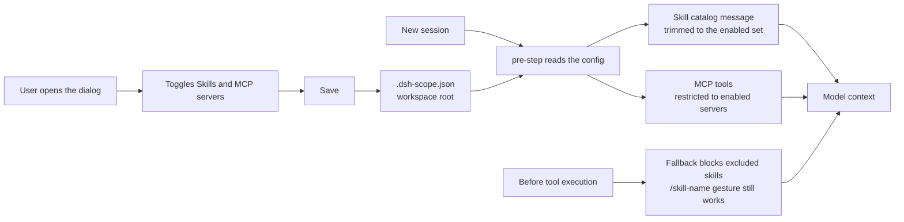

# workspace-scope

[](https://github.com/Ri0n72Y/workspace-scope/actions/workflows/ci.yml) [](https://github.com/Ri0n72Y/workspace-scope/blob/main/LICENSE) [](https://github.com/Ri0n72Y/workspace-scope/releases)

A DeepSeek Harness plugin that turns Skills and MCP servers on and off per workspace.

The more skills and MCP servers you install, the larger the startup context of every new session. This plugin lets each project enable only what it needs, like VS Code with many language packs where each project opens only the ones it uses.

中文版：[README.md](README.md)

## Usage

The entry lives on the new-session screen: the "Workspace scope" button in the tool row of the input card. Ongoing conversations do not show it, since the scope is fixed once a conversation starts and only affects sessions created later.

The dialog lists everything under two groups, Skills and MCP servers, and each group heading can be collapsed on its own:

- A search box filters the entries
- Each row has a switch; on means enabled
- Clicking the row expands details (description for skills, tool count for MCP servers)
- Enable all / disable all quick buttons at the bottom; every change saves immediately

Saving writes the config to `.dsh-scope.json` in the workspace root and only affects sessions created later in that workspace. Once a conversation starts, its config is fixed; changing it mid-conversation does not affect that conversation. Excluded skills can still be loaded ad hoc with the `/skill-name` gesture.

## Configuration

The file is `.dsh-scope.json` in the workspace root:

```json
{
  "default": {
    "mode": "whitelist",
    "skills": ["<skill-name>"],
    "mcps": ["<server-name>"]
  }
}
```

| Field | Type | Meaning |
|---|---|---|
| `mode` | `string` | Always saved as `whitelist`; reading accepts `default` (everything enabled) and `blacklist` (list means excluded) |
| `skills` | `string[]` | Enabled skill names |
| `mcps` | `string[]` | Enabled MCP server names |

## Data flow



## Contributing

Open an issue for bugs or ideas. Before sending a pull request, read [CONTRIBUTING.md](CONTRIBUTING.md). By contributing you agree to the MIT license.

## License

MIT
