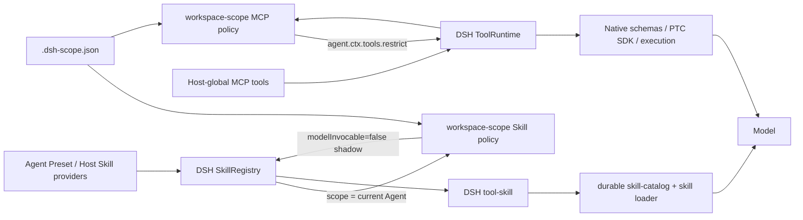

# dsh-workspace-scope

[](https://github.com/Ri0n72Y/dsh-workspace-scope/actions/workflows/ci.yml) [](https://www.npmjs.com/package/dsh-workspace-scope) [](https://github.com/deepseek-ai/deepseek-harness/releases/tag/dsh-v0.1.5-rc.1) [](https://github.com/Ri0n72Y/dsh-workspace-scope/blob/main/LICENSE) [](https://github.com/Ri0n72Y/dsh-workspace-scope/releases)

## 插件正在积极开发中，版本更新频繁

DeepSeek Harness 工作区能力策略插件：对当前 Agent 已拥有的 Skill 与 Host 全局 MCP 应用工程级启停策略。

DSH 的 Agent Preset、Host 插件和 Skill provider 负责提供能力；本插件不安装 Skill，也不创建第二套 Skill catalog。它只在当前 Agent 的有效能力视图上应用 `.dsh-scope.json`，让不同工程暴露不同的能力集合。

MCP 范围明确指 Host 全局注册、由 Agent 继承的 MCP 工具。Agent / Preset 作用域内注册的 MCP / Tool 不由本插件管理。DSH 0.1.5 的 `ToolSchema` 尚未提供稳定的 MCP owner metadata，因此 0.5 管理的 MCP `serverName` 不应包含 `__`；raw tool name 可以包含 `__`。

完整的 Skill / Tool 数据流、C4 图和 0.5 集成约束见 [docs/architecture.md](docs/architecture.md)。

English version: [README.en.md](README.en.md)

## 用法

入口在新建会话的空白 Session：输入卡右侧工具行里的「工作区能力」按钮。已进行的对话不显示入口。配置会在该会话第一次真正开始模型请求时锁定；如果此时已有本插件发出的 autosave 正在写入，会先等该写入完成。因此新建界面中的改动能作用于即将开始的对话，之后再修改文件不会改变已经锁定的会话。

弹窗按「技能」和「全局 MCP 服务器」两个分组展示当前可管理条目：

- Skill 只显示当前空白 Session 对应 Agent 中可由模型调用的 scoped Skill view；切换 Agent Preset 后列表随之更新
- 当前 Agent 中不存在或本身已设置 `modelInvocable: false` 的 Skill 不显示；`.dsh-scope.json` 中已有的其他 Preset 配置仍保留
- 每行一个开关，打开即启用；已被当前工作区禁用的 Skill 仍按原样显示「已禁用」
- 点行本身展开详情（Skill 显示描述，全局 MCP 显示工具数量）
- 搜索、全部启用、全部禁用只操作当前界面可管理的能力，改动即时保存

保存后配置写入当前工作区根目录的 `.dsh-scope.json`。

当前 Agent 存在模型 `skill` Tool surface 时，Skill 策略会在每个 `agent/pre-step` 开始时刷新：插件先读取当前 Agent 的 DSH `SkillRegistry` 视图，再为被工作区排除的 Skill 注册 exact-Agent shadow，将 `modelInvocable` 设为 `false`。随后 DSH 自己的 `tool-skill` 根据同一个 scoped view 生成 Skill catalog 和 `skill` loader。被排除但原本允许用户调用的 Skill 仍可通过 `/技能名` 显式加载。

Host 全局 MCP 在真实 `system-prompt/assemble` 时通过 Agent 原生 `tools.restrict()` 约束。若有效 mask 发生变化，插件让 DSH 重做一次完整 assembly，因此 native Tool schemas、PTC SDK、查找与执行都使用同一个 ToolRuntime 视图。

## 配置

文件在工作区根目录，名为 `.dsh-scope.json`：

```json
{
  "default": {
    "mode": "whitelist",
    "skills": ["<skill-name>"],
    "mcps": ["<server-name>"]
  }
}
```

| 字段 | 类型 | 说明 |
|---|---|---|
| `mode` | `string` | `default` 表示全部启用；`whitelist` 中列表为允许集；`blacklist` 中列表为排除集。UI 保留现有 `whitelist` / `blacklist` 语义；`default` 首次产生禁用时转为 `blacklist` |
| `skills` | `string[]` | 含义由 `mode` 决定；当前 Agent 不显示的名字仍会保留，供其他 Preset 使用 |
| `mcps` | `string[]` | 含义由 `mode` 决定；只管理 Host 全局 MCP 服务器 |

## 数据流

Skill 与 Tool/MCP 使用 DSH 各自的原生 registry；workspace-scope 只插入策略层。



DSH 0.1.5 中，Skill catalog 由 `tool-skill` 在 `agent/pre-step` 生成 durable `user/message`，不属于 `system-prompt` 文本。本插件不解析或改写 `<available_skills>`。DSH 尚未公开 `tool-skill` 私有 ToolDefinition 的精确 identity，因此同名 `skill` Tool 覆盖官方 `tool-skill` 的自定义 Preset 不属于 0.5 的精确支持范围；详见架构文档。

## 贡献

发现 bug 或有想法，直接开 issue；想动手改，先读 [CONTRIBUTING.md](CONTRIBUTING.md) 再提 PR。提交即表示同意按 MIT 许可授权。

## License

MIT