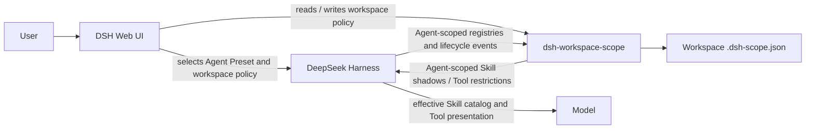
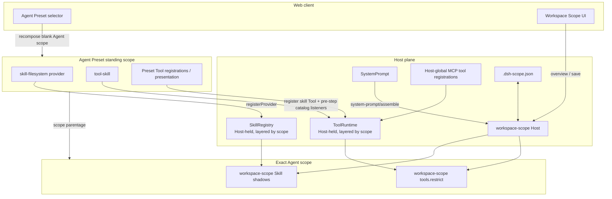
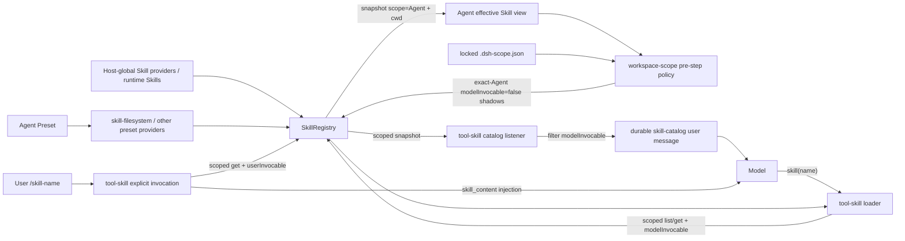
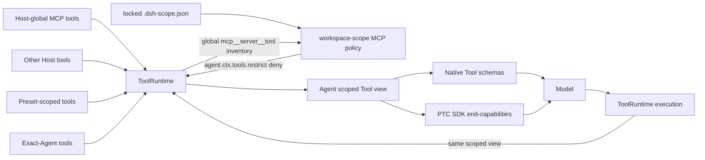
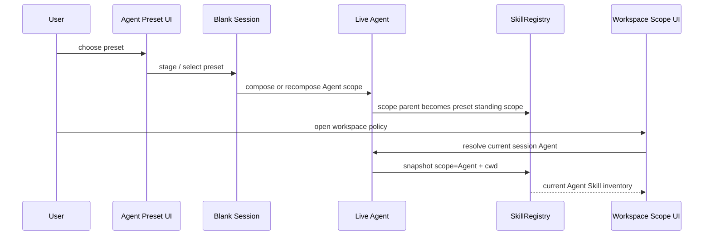

# Architecture and data flow

This document describes the integration boundary of `dsh-workspace-scope` against DeepSeek Harness `0.1.5-alpha.1`. The diagrams use C4-style levels with ordinary Mermaid flowcharts so they render on GitHub without requiring the Mermaid C4 extension.

## Scope

`dsh-workspace-scope` is a workspace policy layer over capabilities already composed by DSH.

- Agent Presets and Host composition provide capabilities.
- DSH registries resolve the effective capability view for an Agent.
- `dsh-workspace-scope` narrows that view for one workspace.
- DSH remains the only owner of model-facing Skill catalogs, Skill loading, Tool schemas, PTC SDK generation, and Tool execution.

The plugin does not install Skills, discover Skill files itself, create a second Skill catalog, or manage Agent/Preset-scoped MCP registrations.

## C4 — system context



`dsh-workspace-scope` sits between DSH capability composition and DSH's final model projection. It changes registry state through public scoped seams; it does not edit model-facing prompt or catalog text directly.

## C4 — containers and ownership



The preset is a standing scope mounted once per preset. An Agent joins it through scope parentage. The exact Agent scope is therefore the correct place for workspace-local policy: it can narrow inherited capability without modifying the preset definition shared by other Agents.

## Skill data flow

### 1. Capability sources

The Host owns one layered `SkillRegistry`. Skill providers register into the layer of the context that mounted them.

The standard DSH preset mounts `@deepseek-ai/dsh-skill-filesystem` in its preset scope. Its filesystem provider discovers, according to its configuration, project, custom, user, and bundled Skill roots, including the default roots:

```text
<project>/.dsh/skills
<project>/.agents/skills
~/.dsh/skills
~/.agents/skills
bundled skills
```

Other Host or preset plugins may contribute additional providers or runtime Skills.

### 2. Agent-scoped resolution

The authoritative read for one Agent is:

```ts
skills.snapshot({
  scope: agent,
  cwd: agent.session.header.cwd,
  signal,
})
```

The registry merges the global layer and the Agent's scope chain. A nearer scope wins a duplicate Skill name; provider rank is only a tie-breaker inside one layer. The scope chain is part of the registry cache key, so re-parenting a blank Agent to another preset changes the next scoped read even though the Agent/session id stays the same.

A read without `scope` sees only the global layer and therefore cannot represent the Skill set of a preset-composed Agent.

### 3. Workspace policy

At each `agent/pre-step`, `dsh-workspace-scope` first disposes its previous runtime shadows, reads the unmodified Agent-scoped Skill view, and computes the workspace deny set from the locked `.dsh-scope.json`.

For each denied Skill that is currently model-invocable, the plugin registers an exact-Agent runtime shadow with:

```ts
{
  modelInvocable: false,
  userInvocable: original.userInvocable,
}
```

The plugin then re-reads the scoped catalog and fails the step if a denied Skill is still model-invocable. This catches the DSH same-layer first-wins case where an existing exact-Agent runtime Skill cannot be shadowed later.

### 4. DSH model projection

`@deepseek-ai/dsh-tool-skill` owns both model-facing Skill paths:

- the `skill` Tool loads a Skill through the same `{ scope: agent, cwd, signal }` lookup and requires `modelInvocable`;
- an `agent/pre-step` listener snapshots the same Agent-scoped registry, filters `modelInvocable`, and publishes the durable session Skill catalog.

In DSH 0.1.5, the Skill catalog is a durable injected `user/message` (`source.kind = "skill-catalog"`), not a `system-prompt` section. The catalog contains `<available_skills>` for the model and is replaced when its effective entries change.

A separate `agent/pre-step` listener handles explicit `/skill-name` invocation. It checks `userInvocable` and injects the Skill body as `<skill_content>`. Therefore a workspace-disabled Skill can remain explicitly user-invocable while disappearing from the model catalog and the model-callable `skill` loader.

### Complete Skill flow



## Tool and MCP data flow

### 1. Tool sources and layered view

DSH owns one layered `ToolRuntime`. Host composition, Agent Presets, and exact Agent scope may all register tools. Scoped registrations shadow farther definitions.

`ToolRuntime` derives one scoped view used by presentation, lookup, and execution. This is important: a restriction applied through the Tool registry cannot leave the model schema and executable registry disagreeing.

### 2. Workspace MCP boundary

This plugin manages only Host-global MCP tools. DSH exposes those tools using the public `mcp__<server>__<tool>` name contract, which the plugin groups into MCP servers for its UI.

The plugin does not manage MCP/tool registrations created inside Agent or Preset scopes.

### 3. Agent restriction

On the first real `system-prompt/assemble` of a turn, the workspace config is read and locked. The plugin computes the denied Host-global MCP tool-name set and installs:

```ts
agent.ctx.tools.restrict({ deny })
```

DSH restrictions apply to inherited tools and intersect along the scope chain. Exact-scope registrations and the reserved PTC transport remain outside the restriction.

If the effective MCP mask changes during assembly, the plugin discards the pre-policy assembly and performs one complete `systemPrompt.assemble(context)` under the new restriction. DSH then builds the model-facing Tool projection from the restricted scoped view.

### 4. Native and PTC presentation

`ToolRuntime` supplies Tool schemas to `SystemPrompt` from `wireSchemas(context.scope)`:

- native mode presents the visible Tool schemas directly;
- PTC mode presents `run_code` and generates the SDK from the same scoped visible Tool set;
- both mode exposes both representations.

Tool lookup and execution use the same scoped registry view. `tools.restrict()` is therefore the policy seam that keeps native schema presentation, PTC SDK generation, lookup, and execution aligned.

### Complete Tool/MCP flow



## New-session and preset lifecycle

The Web preset picker and workspace policy UI live at different points of the new-session flow.

DSH's preset picker can stage a preset before a Session exists. Once a blank Session becomes current, the host composes or recomposes its live Agent under that preset. `conversation.input.right`, where the Workspace Scope button is mounted, is rendered only when the composer has a Session. Therefore the Workspace Scope UI can require a live Agent and should not fall back to a global Skill snapshot.

A preset can also be changed while the same blank Session remains current. DSH re-parents the existing Agent scope; the session id does not change. Workspace Scope must therefore refresh its Skill inventory when the current session's `agentPreset` projection changes, not only when the session id changes.



## 0.5 integration invariants

1. The Skill list in the Workspace Scope UI comes only from the current live Agent's scoped SkillRegistry view. There is no global-snapshot fallback.
2. The UI displays only Skills in that scoped view. A Skill name retained in `.dsh-scope.json` but absent from the current Agent remains hidden and is not given an additional "unavailable" state.
3. Hidden/off-preset names in `.dsh-scope.json` are configuration data for other preset states and must not be discarded merely because the current UI cannot see them.
4. Workspace Scope never scans Skill files, registers a Skill provider, creates a Skill loader, or renders a second `<available_skills>` catalog.
5. Workspace Skill shadows are refreshed before DSH `tool-skill` pre-step listeners run.
6. Workspace-disabled Skills set only `modelInvocable: false`; the original `userInvocable` policy is preserved.
7. Host-global MCP remains the only Tool/MCP inventory managed by this plugin. Agent/Preset-scoped Tool registrations remain outside its MCP policy boundary.
8. MCP filtering continues through exact-Agent `tools.restrict()`, so native, PTC, lookup, and execution share one restricted ToolRuntime view.
9. A blank-session preset change must trigger a new UI Skill snapshot even when the session id is unchanged.
10. `serviceForAgent()` is not used to mutate preset internals. The Host-held scoped registries are the integration seam.

## Policy lock lifecycle

`.dsh-scope.json` remains a workspace document with the existing schema. UI changes are saved immediately, but one live Agent locks the effective policy on its first real turn-owned prompt assembly. Later edits affect future conversations, not that already-started Agent.

Skill policy is refreshed at every pre-step from the locked config because Skill providers may change while the Agent lives. MCP policy is reconciled at each real prompt assembly because Host-global MCP registrations may change while the process lives.
